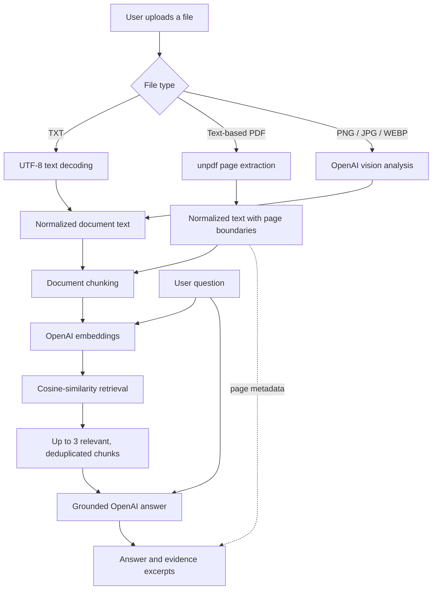

# Ask My Docs

**Multimodal AI Document Assistant**

[Live Demo](https://ask-my-docs-mocha.vercel.app) · [GitHub Repository](https://github.com/benitanidinmi/ask-my-docs)

Ask My Docs is a production-ready AI application that lets users upload TXT files, text-based PDFs, images, and screenshots, then ask questions grounded in their content.

The system combines document parsing, multimodal image understanding, semantic retrieval, and source-backed answer generation. Responses include evidence excerpts and real PDF page citations, while serverless rate limiting protects public API usage and costs.

## Product overview

Finding one specific detail in a long document often requires reading or searching through the entire file. Ask My Docs provides a shorter workflow: upload a supported file, ask a natural-language question, and receive a concise answer based only on relevant content retrieved from that file.

The responsive workspace keeps the document, question, answer, and supporting evidence together. Light and dark themes are included for comfortable use across devices.

## Key features

- Direct processing of UTF-8 TXT files
- Text extraction from text-based PDFs
- PNG, JPG/JPEG, and WEBP image or screenshot understanding
- Multimodal processing with an OpenAI vision-capable model
- Embedding-based semantic retrieval with cosine similarity
- Grounded question answering from retrieved context
- Deterministic evidence excerpts alongside supported answers
- Real page references for PDF evidence
- Explicit fallback when the retrieved context cannot support an answer
- Serverless-safe burst, per-visitor daily, and global daily rate limits
- API cost protection with fail-closed paid AI operations
- Responsive two-column desktop workspace and compact mobile layout
- System-aware light and dark themes with saved user preference
- Production deployment on Vercel

> Scanned or image-only PDFs are not processed as OCR documents. A scan can instead be uploaded as a supported image when appropriate.

## How it works



TXT input is decoded directly. PDF pages are extracted individually and serialized with internal page markers so page metadata survives later chunking. Image input is validated and converted into a faithful textual representation by the vision model. When a question is submitted, the application embeds the question and document chunks, ranks them by cosine similarity, removes near-duplicate results, and passes up to three relevant chunks to the answer model.

## Grounding and evidence

The answer model does not receive unrestricted external context. It receives the user's question and only the document chunks selected by semantic retrieval. This narrows the evidence available to the model and reduces unsupported answers.

For supported answers, the API returns deterministic excerpts from the retrieved chunks:

- TXT evidence is labeled as a relevant passage.
- PDF evidence retains the extracted page number where available.
- Image-derived evidence is labeled `Image analysis`; the application does not invent page numbers or visual coordinates.

When the retrieved content cannot support an answer, the application uses this explicit fallback and omits sources:

```text
Bu bilgi dokümanda bulunamadı.
```

This design reduces unsupported responses, but it does not claim to eliminate model error completely.

## Multimodal support

| Input | Processing |
| --- | --- |
| TXT | Validated as UTF-8 and processed directly in memory. |
| PDF | Text is extracted from text-based PDFs with `unpdf`; page boundaries are retained for citations. |
| Images | PNG, JPG/JPEG, and WEBP content is validated and analyzed with `gpt-4.1-mini` at high image detail. |

The image analysis prompt captures visible text, headings, labels, values, tables, UI controls, error messages, and meaningful visual relationships without claiming content that is not visible.

## Rate limiting and cost protection

Paid AI operations are protected by an atomic Upstash Redis rate limiter designed for serverless execution. A single Lua operation checks all three scopes before incrementing any counters, so a request rejected by one scope does not consume the others.

Default limits:

| Scope | Default |
| --- | ---: |
| Per-visitor burst | 3 AI operations per minute |
| Per-visitor daily | 10 AI operations per UTC day |
| Global daily | 200 AI operations per UTC day |

Additional safeguards:

- Visitor identities are HMAC-SHA-256 hashed with `RATE_LIMIT_HASH_SALT` before they are used in Redis keys.
- Raw IP addresses are not intentionally stored in Redis keys.
- Rate-limit checks fail closed with HTTP `503` when Redis configuration or enforcement is unavailable.
- Rejected limits return HTTP `429` with a `Retry-After` header.
- OpenAI SDK retries are disabled (`maxRetries: 0`) to avoid hidden duplicate cost.
- TXT and PDF parsing do not consume AI quota. Image analysis consumes an AI operation during upload, and each question consumes another AI operation.

The three defaults can be overridden with positive integer environment variables; see [Environment variables](#environment-variables).

## Tech stack

| Area | Technology |
| --- | --- |
| Framework | Next.js 16 App Router, React 19 |
| Language | TypeScript |
| Styling | Tailwind CSS 4 and CSS custom properties |
| Answer generation | OpenAI API, `gpt-4.1-mini` |
| Retrieval | `text-embedding-3-small` embeddings and cosine similarity |
| Multimodal analysis | OpenAI Responses API, `gpt-4.1-mini` vision |
| PDF processing | `unpdf` |
| Rate limiting | Upstash Redis with atomic Lua enforcement |
| Deployment | Vercel |

## Serverless architecture

The application does not depend on Vercel's ephemeral filesystem for document persistence. Uploads are validated and processed in memory by `/api/upload`; the processed document content and its type are returned to the client. The client then sends that content with the question to `/api/ask` for chunking, retrieval, and answer generation.

This stateless flow is compatible with serverless deployment and avoids maintaining a server-side document store. Redis is used only for durable rate-limit counters, not document content.

## Supported files and limits

| Input | Limit | Notes |
| --- | ---: | --- |
| TXT | 100,000 bytes | Must contain valid UTF-8 text. |
| PDF | 4,000,000 bytes | Text-based PDFs only; maximum 100 pages. |
| PNG/JPG/JPEG/WEBP | 4,000,000 bytes | Maximum 10,000 px per side and 20 megapixels total. |
| Extracted document text | 100,000 characters | Applies after PDF or image processing as well as text input. |
| Question | 2,000 characters | Whitespace-only questions are rejected. |

Empty files, mismatched MIME types, malformed documents, and password-protected or unreadable PDFs are rejected with intentional validation responses.

## Running locally

Requirements: Node.js 22 or newer, an OpenAI API key, and writable Upstash Redis REST credentials.

```bash
git clone https://github.com/benitanidinmi/ask-my-docs.git
cd ask-my-docs
npm install
```

Create `.env.local` with placeholder values replaced by your own credentials:

```env
OPENAI_API_KEY=your_openai_api_key
RATE_LIMIT_HASH_SALT=your_secure_random_salt

# Preferred when using the Vercel integration
KV_REST_API_URL=https://your-redis-rest-endpoint
KV_REST_API_TOKEN=your-writable-redis-token

# Or use the Upstash aliases instead
# UPSTASH_REDIS_REST_URL=https://your-redis-rest-endpoint
# UPSTASH_REDIS_REST_TOKEN=your-writable-redis-token
```

Generate `RATE_LIMIT_HASH_SALT` as a long, cryptographically secure random value. Do not commit `.env.local`.

Start the development server:

```bash
npm run dev
```

Then open [http://localhost:3000](http://localhost:3000).

Useful checks:

```bash
npm run lint
npm run test:rate-limit
npm run build
```

## Environment variables

| Variable | Required | Purpose |
| --- | --- | --- |
| `OPENAI_API_KEY` | Yes | Vision analysis, embeddings, and grounded answer generation. |
| `RATE_LIMIT_HASH_SALT` | Yes | HMAC salt used to hash visitor identity before constructing Redis keys. |
| `KV_REST_API_URL` | One Redis URL/token pair | Preferred writable Redis REST endpoint when provided by the Vercel integration. |
| `KV_REST_API_TOKEN` | One Redis URL/token pair | Writable token paired with `KV_REST_API_URL`. |
| `UPSTASH_REDIS_REST_URL` | Alternative pair | Fallback Upstash REST endpoint. |
| `UPSTASH_REDIS_REST_TOKEN` | Alternative pair | Writable token paired with the Upstash URL. |
| `AI_BURST_LIMIT` | No | Positive integer override for the per-minute visitor limit; default `3`. |
| `AI_DAILY_LIMIT_PER_VISITOR` | No | Positive integer override for the per-visitor UTC daily limit; default `10`. |
| `AI_GLOBAL_DAILY_LIMIT` | No | Positive integer override for the global UTC daily limit; default `200`. |

The application prefers a complete `KV_REST_API_URL` / `KV_REST_API_TOKEN` pair, then falls back to a complete `UPSTASH_REDIS_REST_URL` / `UPSTASH_REDIS_REST_TOKEN` pair.

## Production deployment

The live application is deployed on Vercel: [ask-my-docs-mocha.vercel.app](https://ask-my-docs-mocha.vercel.app).

Production requires the OpenAI key, hash salt, and one writable Redis REST credential pair to be configured in the Vercel project environment. No uploaded documents need to be persisted to the deployment filesystem.

## Screenshots

<!-- Optional: add an intentionally committed production screenshot here. -->

No screenshot assets are currently stored in this repository. The [live demo](https://ask-my-docs-mocha.vercel.app) shows the current responsive workspace and light/dark themes.

## Engineering decisions

- **Stateless document handling:** uploaded content is processed in memory instead of relying on ephemeral serverless storage.
- **Grounded retrieval:** only semantically selected document chunks are supplied to the answer model.
- **Deterministic evidence:** evidence excerpts are derived directly from retrieved chunks rather than generated separately by the model.
- **Real PDF page boundaries:** page markers survive normalization and chunking so evidence can reference the extracted page.
- **Atomic quota enforcement:** all three rate-limit scopes are checked and incremented in one Redis Lua operation.
- **Fail-closed AI operations:** missing or unavailable rate-limit infrastructure prevents paid AI calls.
- **Explicit unsupported-answer path:** insufficient context produces a fixed fallback instead of encouraging a guess.
- **Bounded AI cost:** request limits, output-token limits, and disabled automatic retries constrain public-demo usage.

## Current scope and limitations

- PDFs must contain extractable text; scanned or image-only PDFs are not OCR-processed as PDFs.
- There is no account system or persistent document library.
- Documents are retained in the active client flow rather than stored server-side for later sessions.
- Public demo usage is rate limited, and image uploads use AI quota during analysis.
- Answers are intentionally restricted to the retrieved document context and may return the not-found fallback when evidence is insufficient.
- Semantic retrieval ranks relevant chunks but does not guarantee that every useful passage will be selected.

## License

No license file is currently included. All rights are reserved unless a license is added later.
